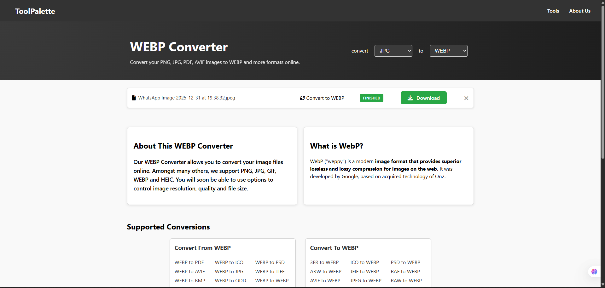
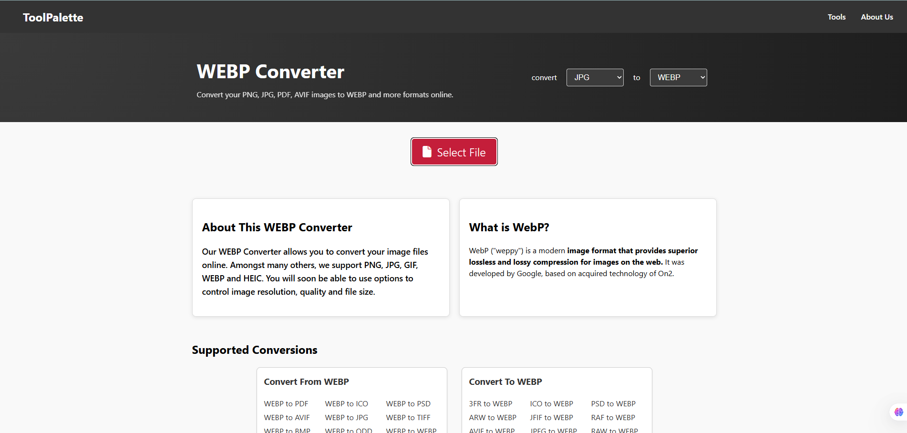

# ToolPalette Frontend

ToolPalette is a comprehensive collection of online tools designed to simplify your daily digital tasks. This frontend is built with Svelte 5 and Vite, providing a fast and responsive user experience.

## Screenshots

<div align="center">
  
  
</div>

---

## Architecture Overview

The application follows a modular architecture designed for scalability and maintainability:

- **Frontend Framework:** [Svelte 5](https://svelte.dev/) - Utilizing the latest Runes API for reactive state management.
- **Build Tool:** [Vite](https://vitejs.dev/) - Ensuring ultra-fast development and optimized builds.
- **UI Framework:** [Skeleton UI](https://www.skeleton.dev/) - A powerful UI toolkit for Svelte built with Tailwind CSS (configured for Svelte 5).
- **Routing:** [svelte-spa-router](https://github.com/ItalyPaleAle/svelte-spa-router) - A lightweight, hash-based router for Single Page Applications.
- **Architecture Pattern:** Feature-based routing with centralized services for business logic.

---

## Folder Structure

```text
toolpalette-frontend/
├── docs/                # Project documentation and visual assets
│   ├── image1.png       # Application screenshot
│   └── image2.png       # Feature screenshot
├── public/              # Static assets (images, icons, etc.)
├── src/
│   ├── assets/          # Static assets like SVGs
│   ├── components/      # Reusable UI components (Navbar, Footer, etc.)
│   ├── lib/             # Utility and shared components
│   ├── routes/          # Page components defining application views
│   │   ├── Home.svelte
│   │   ├── About.svelte
│   │   └── ImageConverter.svelte
│   ├── services/        # Business logic and API interaction layers
│   ├── theme/           # Application styling and themes
│   ├── App.svelte       # Root component and route configuration
│   ├── app.css          # Global styles
│   └── main.js          # Main entry point
├── package.json         # Project metadata and dependencies
└── vite.config.js       # Vite build configuration
```

---

## Getting Started

### Prerequisites

- Node.js (Latest LTS recommended)
- npm or yarn

### Installation

1. Clone the repository
2. Navigate to the frontend directory:
   ```bash
   cd toolpalette-frontend
   ```
3. Install dependencies:
   ```bash
   npm install
   ```

### Development

Run the development server:
```bash
npm run dev
```

### Building for Production

To create an optimized production build:
```bash
npm run build
```

---

## License

This project is licensed under the MIT License - see the LICENSE file for details.
